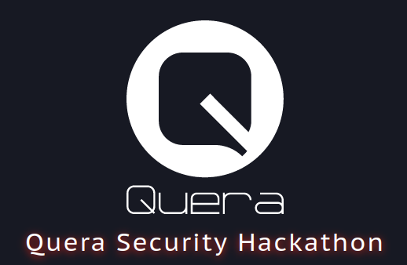
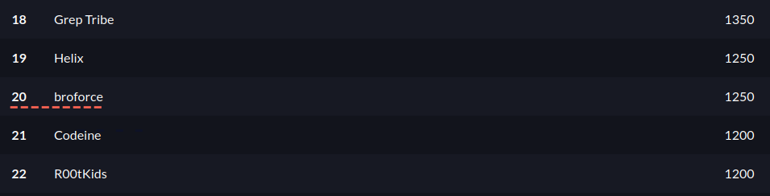

# Quera Security Hackathon Writeups

This year for the first time I participated in a CTF competition organized by [Quera.org](https://quera.org/) . It had 14 challenges on various categories (web, android, crypto, reverse, etc). We ranked 20 in the scoreboard out of 135 teams. :)

The competition had a few flaws at designing the challenges but overall it was an amazing contest and it encouraged me to work harder for upcoming competitions.

 

Now... on to the writeups :)  
We didn't solve all the challenges but I will update the writeups when I find the solutions.
If you any questions or suggestions regarding the writeups submit a new issue or make a pull request.

## ‌

## [Challenge 1: Blinker](blinker/)

## [Challenge 2: Simple Wasm](simple-wasm/)

## [Challenge 3: Bad Token](bad-token/)

## [Challenge 4: Customer Care](customer-care/)

## [Challenge 5: P01NTLE55](pointless/)

## [Challenge 6: app-fault-1](app-fault-1/)

## [Challenge 7: app-fault-2](app-fault-2/)

## [Challenge 8: Calculator](calculator/)

## [Challenge 9: Login](login/)

## [Challenge 10: Shop](shop/)

## [Challenge 11: CrackMe](crack-me/)

## [Challenge 12: DH Talk](dh-talk/)

## [Challenge 13: Bit ✈️](bit/)

## [Challenge 14: Peaky Blinders](peaky-blinders/)

