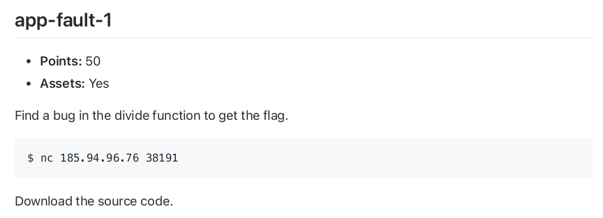
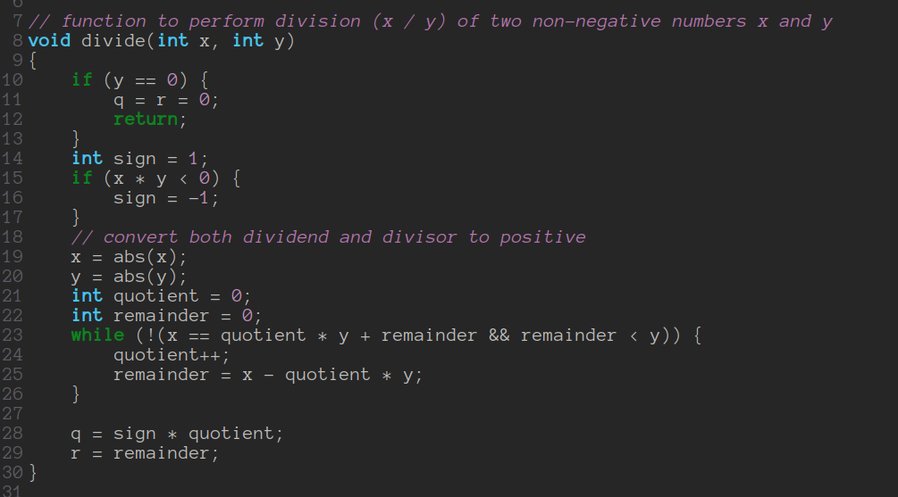
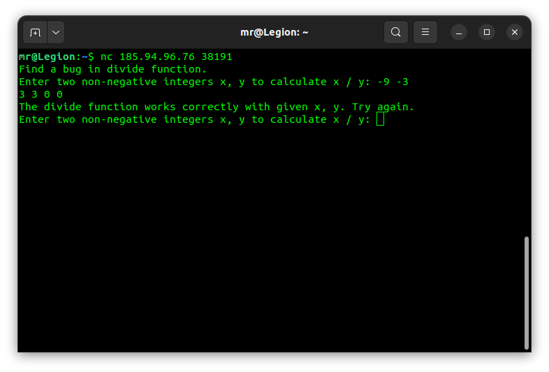
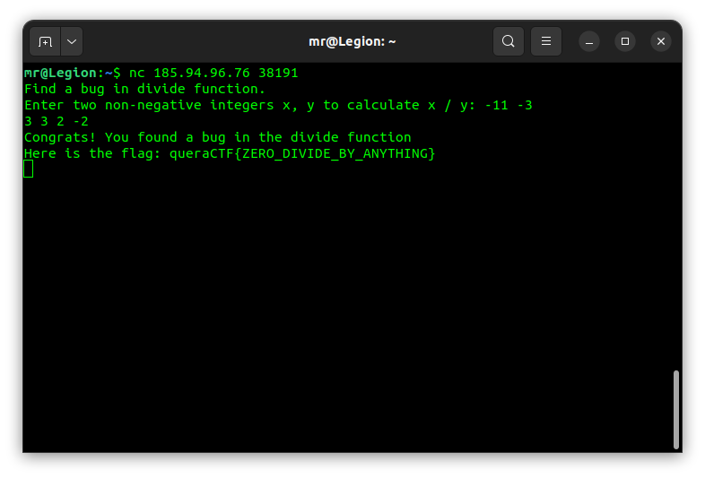

## app-fault-1

At first glance, when you look at the [source code](main-redacted.c), There's a function that calculates the division of two numbers and their remainder.

The comment on line 7 says that this function works for non-negative numbers and there's no input validation in code. So let's try two negative numbers like -9 and -3.

So -9 and -3 don't do anything. The problem with the division function is how it calculates the remainder of two numbers. Since the remainder of two positive numbers are not equal to remainder of their negatives (remainder of 11 and 3 is 2, but the remainder of -11 and -3 is -2). So let's try two numbers that are not divisible.

