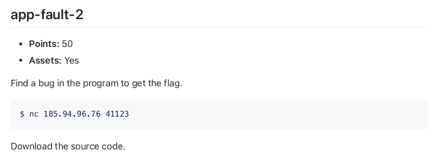
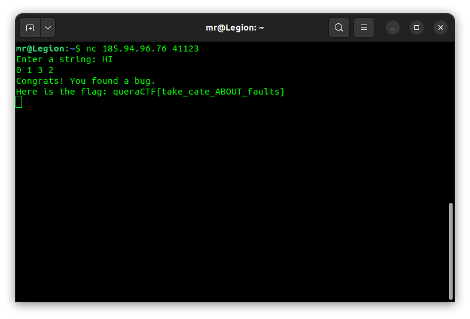

## app-fault-2

The [code](main-redacted.c) takes a string as input and counts the vowels and consonants in the string with two functions (count_vowels_and_consonants and expected_count_vowels_and_consonants) and compare the result of those functions. If the result of those functions are different the code will print the flag. These two functions looks exactly the same but you can see that the first function isn't counting the 'I' character. (`ptr == 'I'` which should be `*ptr == 'I'`)

So if we enter a string that contains the 'I' character we can get the flag.

