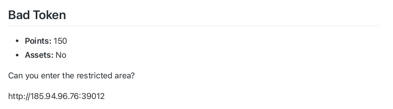
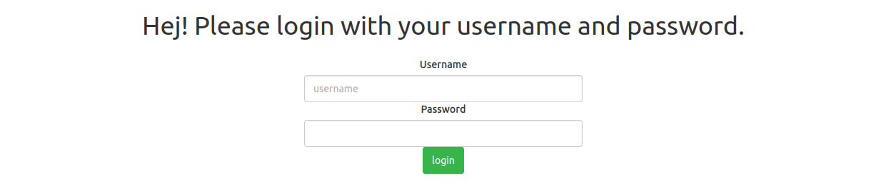
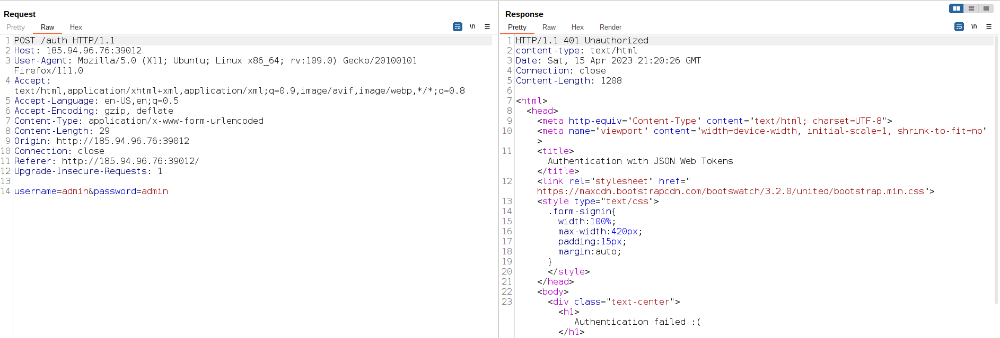
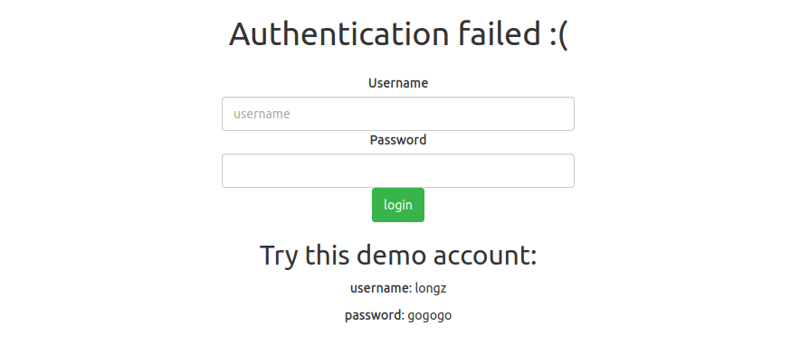
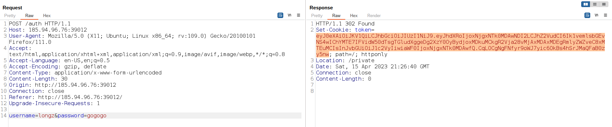
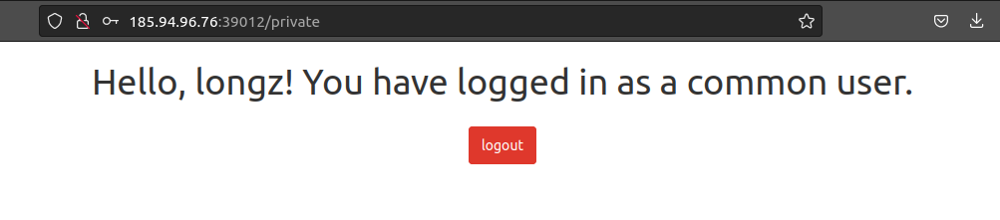
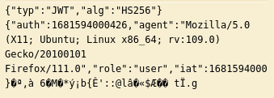
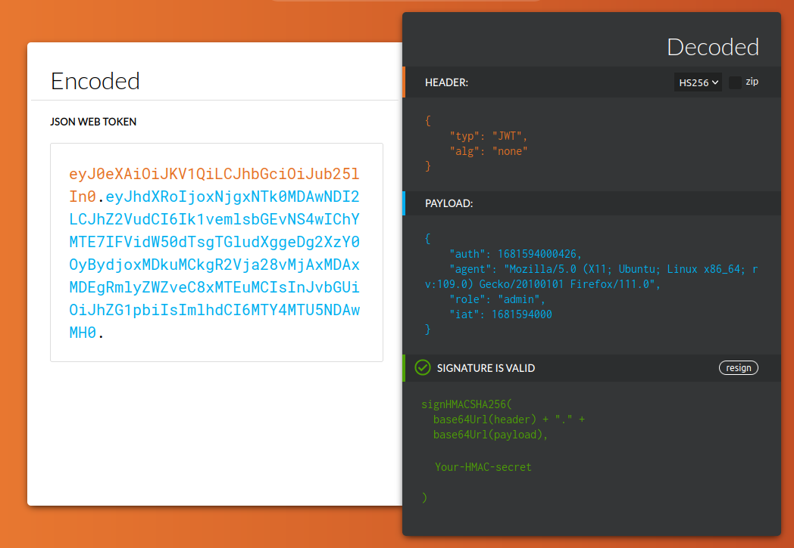
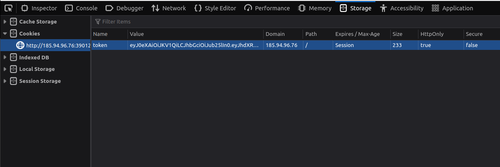
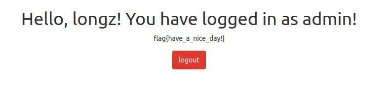

## Bad Token

<p align="center">

</p>
<hr>
<p align="center">

</p>

This challenge is about [JWT](https://en.wikipedia.org/wiki/JSON_Web_Token) vulnerabilities.
Let's use [Burp Suite](https://portswigger.net/burp) to see what happens between client and web server.

<p align="center">

</p>

I used 'admin' for both username and password but as you can see we got a 401 (unauthorized) response. But we can use the credentials in this page to check the demo account.

<p align="center">

</p>

So let's use Burp Suite one more time.

<p align="center">

</p>
<p align="center">

</p>

Looks like we have logged in and now we are in '\private' url path but since this is a demo account we don't have access to anything. But there is something going on in the 'Set-Cookie' header in our response.

It's a three part string that each part is seperated by a dot ('.'). From this we can get the idea that it's probably a JWT (JSON Web Token), but if we just decode this token from base64 we can be sure about it.

<p align="center">

</p>

So basically we have a JWT which its header is : ``` {"typ":"JWT","alg":"HS256"} ```

And the payload is : ``` {"auth":1681594000426,"agent":"Mozilla/5.0 (X11; Ubuntu; Linux x86_64; rv:109.0) Gecko/20100101 Firefox/111.0","role":"admin","iat":1681594000} ```

What we need to do is just edit the "alg" value in the header to "none" and edit the values in the payload so that we can log in as an admin user. In this challenge we need to edit the "role" value to "admin" so we can log in as admin.

Changing the "alg" value to "none" is basically telling the server that there is no need to check the signature (which is a vulnerability in previous versions of JWT), so can just erase the third part of our token (which is the signature) and now we just need to [encode this token](https://irrte.ch/jwt-js-decode/index.html) and replace it with our original token (in inspector window or Burp Suite) and send it to server.

<p align="center">

</p>

<p align="center">

</p> 

Be sure to erase the third part of the token, but keep the last dot. This took us hours to figure out :)

Now if we just refresh the page we can get the flag.

<p align="center">

</p> 

