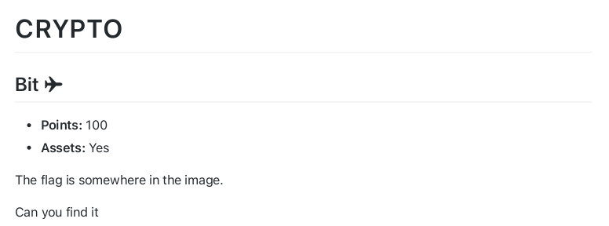
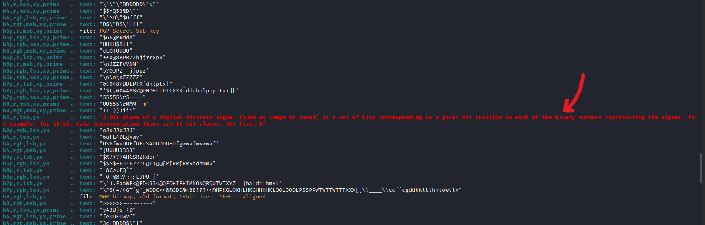
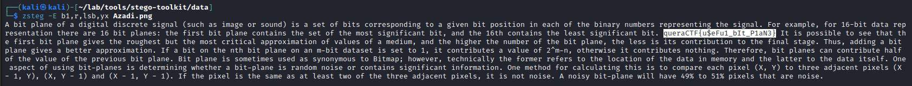

## Bit ✈️

<p align="center">

</p>
<hr>
<p align="center">

</p>

The image is a photo of Azadi soccer field.
I used [Zsteg](https://github.com/zed-0xff/zsteg) with -a option to check if there's any hidden data in the image.

<p align="center">

</p>

And looks like there is. We just need to run zsteg with these parameters to get the flag: ``` $ zsteg -E b1,r,lsb,yx Azadi_Stadium_ACL_2018.png ```

<p align="center">

</p>

