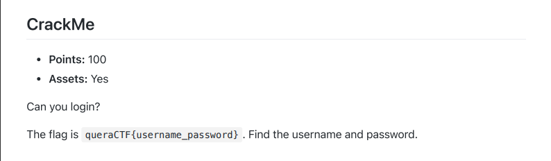
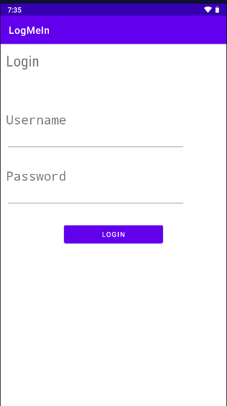
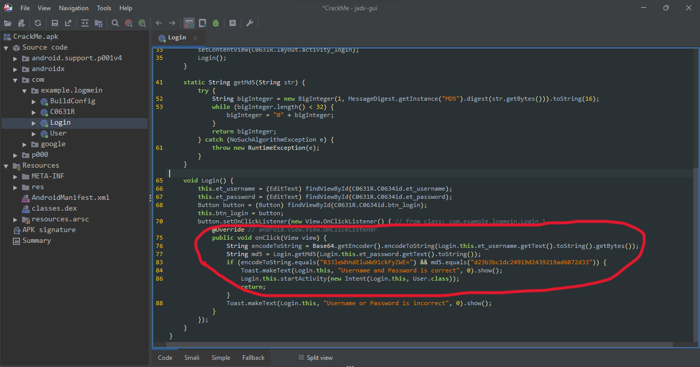
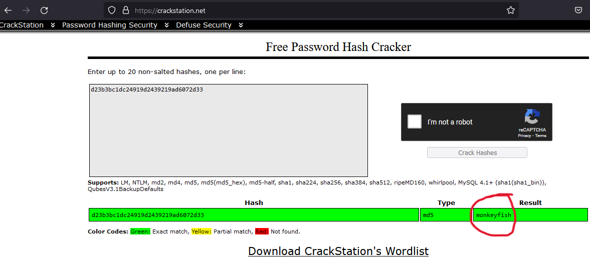

## crack me

install app and see this login screen:

open app with jadx and find login activity so you can see this hashs:

use "from base64" to unhash username:

and some online md5 cracker stuff:

if you finde true username and password you can login:

