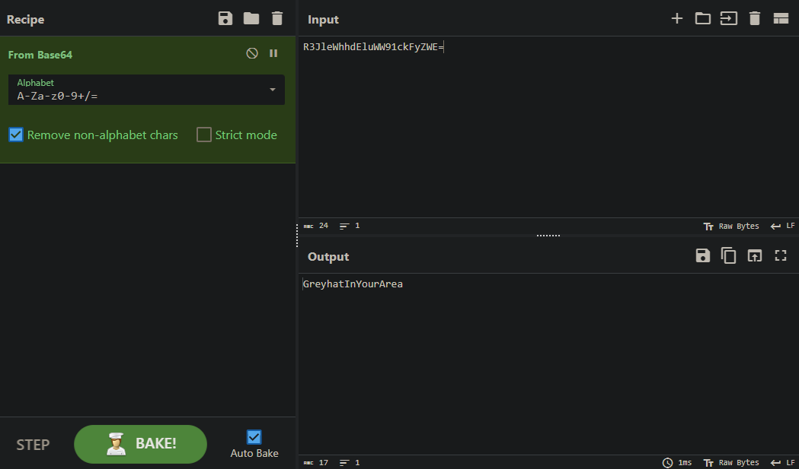

## crack me

So we just need to find the username and password.

When we install the app we see this login screen:

We open the apk file with jadx and find login activity and see these hashes:

Now we decode the username from base64:

And use [CrackStation](https://crackstation.net/) to crack the password which is hashed with md5:

Now we have the username and password, therefore we have the flag.

