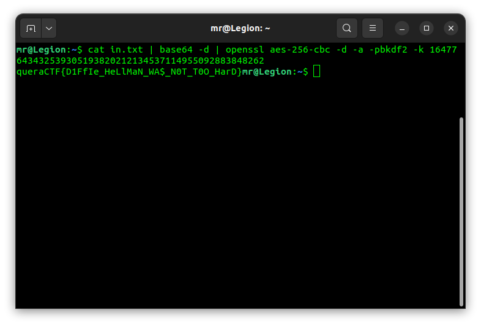

## DH-talk

open the pcap file with "wireshark" and you can see some entries has messages:

DH stands for Diffie-Hellman encryption algorithm so we use [online Diffie-Hellman Key calculator](https://www.dcode.fr/echange-cle-diffie-hellman)
to finde the key of cipher with information we found in pcap file (P, G, a private key, b public key):

run the The command mentioned in the file (replace the "our_shared_key" with the key we found in previous state) and see the flag

