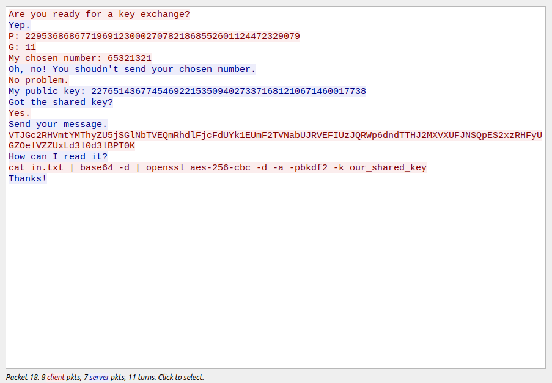

## DH-talk

When we open the pcap file with "wireshark" we can see some entries have messages:

TCP stream of the pcap file clear text

 

DH stands for Diffie-Hellman encryption algorithm so we use [online Diffie-Hellman Key calculator](https://www.dcode.fr/echange-cle-diffie-hellman)
to find the key of cipher with the information we found in pcap file (P, G, a private key, b public key):

Now we just run the The command mentioned in the file (we replace "our_shared_key" with the key we found in previous step) and we can get the flag.

