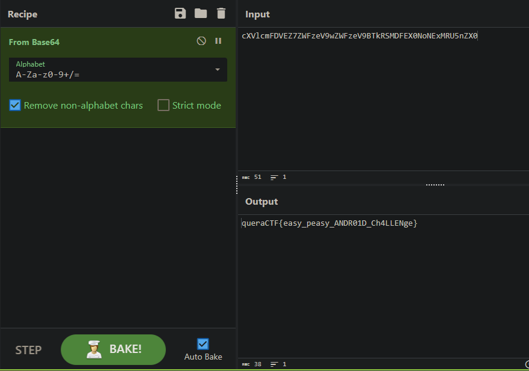

## login

first of all we need to install the app, thats when we see this screen:

checking the application activities in jadx:

we findout the "EmptyActivity" is what we want to access

So without interruption, we go to decompiling the application, in this case i use APK Easy Tool:

Go straight to the application manifest file:

and easily just change Lunch activity from "MainActivity" to "EmptyActivity" by moving intent-filter tag:

compile application and just open it you will see the string:

decode string from Base64 and find the flag:

