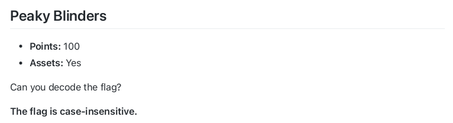
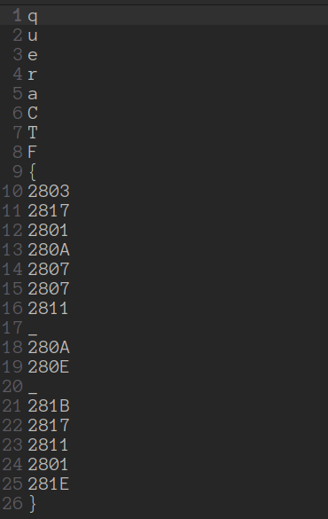
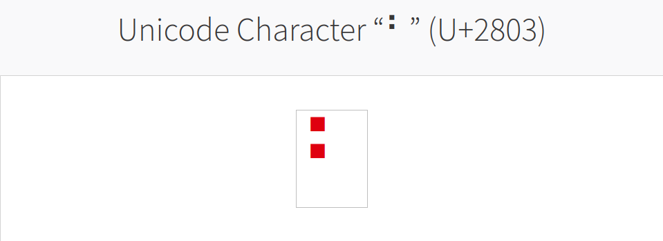
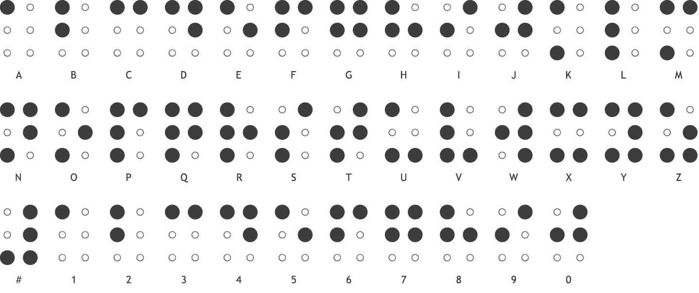

## Peaky Blinders

 

Looks like we just need to decode the flag to get it. It looks like some characters from a table. Let's look up the code '2803' in unicode table.

 

From the name of this challenge we can get the idea behind the challenge. The flag is a message that is written in [Braille](https://en.wikipedia.org/wiki/Braille) font. Now we just need to decode the flag using braille font.

