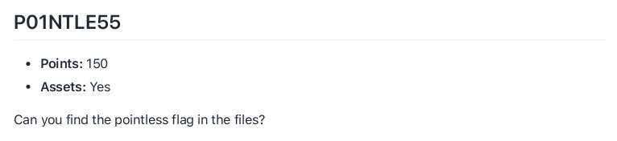
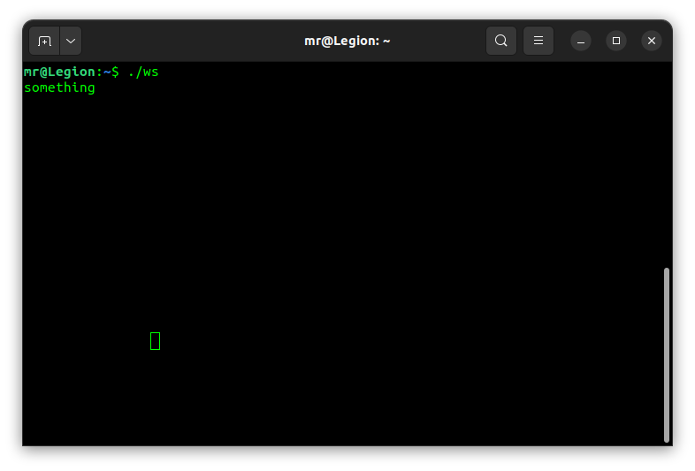
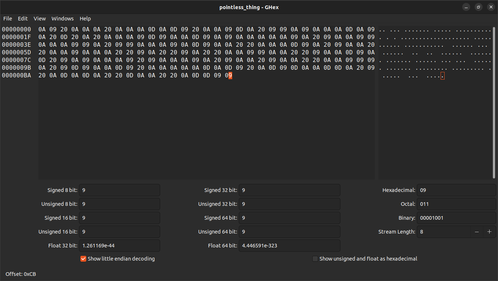
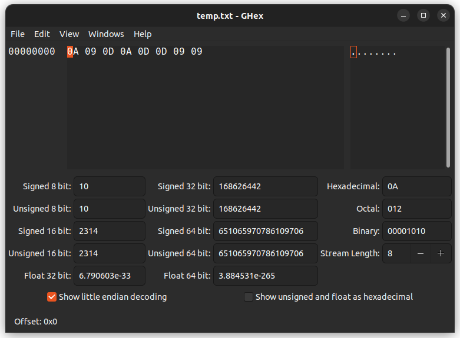
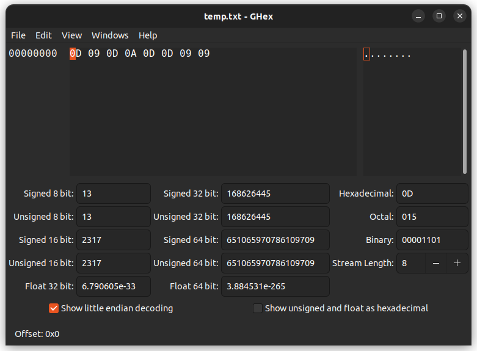

## P01NTLE55

<p align="center">

</p>

This challenge has 2 files. One of them is a binary executable file ([ws](ws)) that is written in C and when you run it, it seems like it doesn't do anything but printing some line feeds ('\n') when you enter something. The other one ([pointless_thing](pointless_thing)) is a text file that is full of 'empty'.

<p align="center">

<p align="center">The binary file only prints some line feeds when you enter something and waits for the next input.</p>
</p>
<br/>
But when you open the 'pointless_thing' in a hex editor you can see that the contents of the file consists of either spaces, tabs, carriage returns and line feeds.

<p align="center">

<p align="center">spaces: 20, carriage returns: 0D, line feeds: 0A, tabs: 09</p>
</p>
<br/>
Let's run the binary file again but this time we only enter one character at a time and save the outputs in a file to see them with hex editor later.

``` $ ./ws > temp.txt ```

<p align="center">

</p>

When we enter 'a\n' the binary file give us :`\n\t\r\n\r\r\t\t`

Let's try this with another character.

<p align="center">

</p>

When we enter 'b\n' the binary file give us :`\r\t\r\n\r\r\t\t`

With a few more examples like this you will realize the binary file is basically a convertor that takes a character and gives it back as a string consisting line feeds, tabs, spaces or carriage returns.

Now we just need to find ascii lowercase and uppercase letters and digits and punctuations output and finally 'encode' the 'pointless_thing' file and get the flag.


<br/>
<hr/>
<br/>
<b>If you know a better and quicker way please submit a new issue. :)</b>


