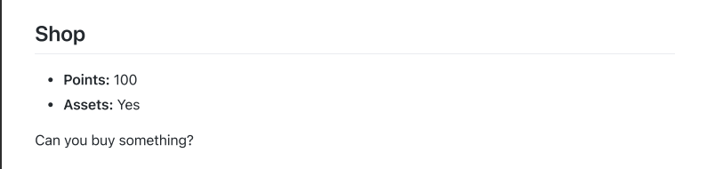
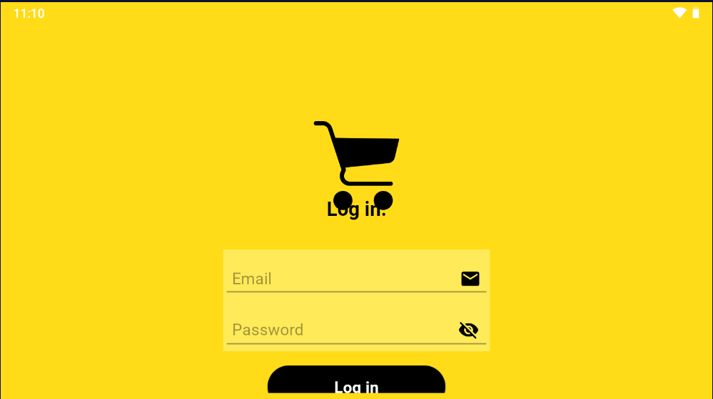
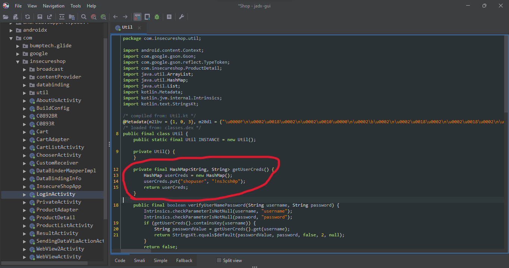
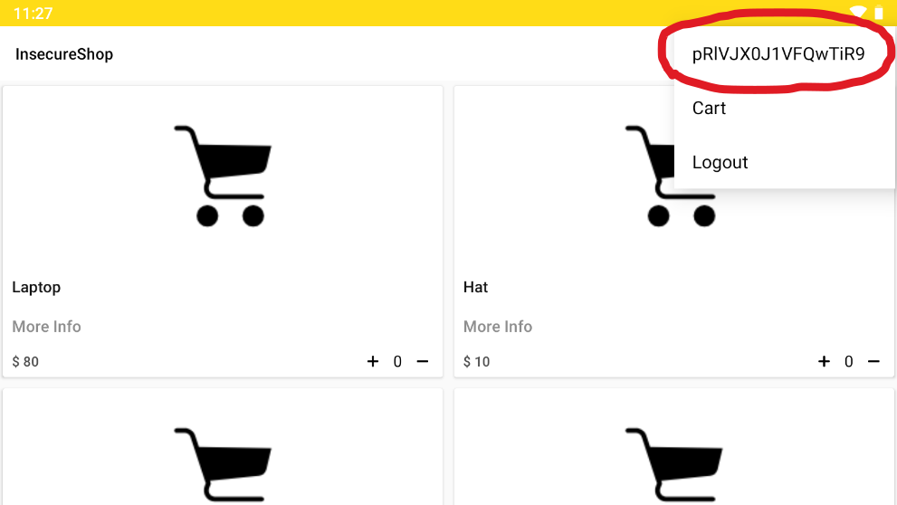
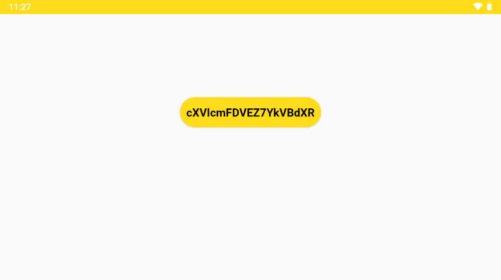

## shop

After installing the app we see this page:

When we check the application with "jadx" we find the username and password here:

Now we login with username and password. We can see half of the flag in the top-right menu:

When we click on it we will see the other part of flag:

Now we just merge two parts of the flag and decode it from base64 to find the flag.
